# Feedback-AI

面向多渠道用户反馈处理场景的智能分析系统。系统支持 Webhook、Excel、Steam 公开评论等来源接入，基于 DeepSeek、Embedding 向量和 Elasticsearch KNN 完成反馈拆分、分类、相似 Bug 召回、Issue 归并、禅道同步、周报生成和飞书推送，形成从反馈接入、智能分析到研发跟进的闭环。

---

## 功能特性

- **多渠道接入**：支持标准 Webhook、Excel 导入、手动提交和 Steam 公开评论采集。
- **产品级隔离**：每个产品拥有独立 Webhook Token，同一产品可配置多个 `sourceKey` 来源入口。
- **智能分析**：对原始反馈进行低质量过滤、片段拆分、分类分流、摘要生成和关键词提取。
- **Bug 聚合**：基于向量召回相似历史 Bug，为新建或归并 Issue 提供候选上下文。
- **建议聚合**：沉淀高频建议和本周新建建议，辅助产品需求判断和排期参考。
- **好评聚合**：对明确对象的正向反馈做语义聚类，展示高频好评对象和代表反馈。
- **禅道联动**：自动同步有效 Bug 到禅道，支持备注追加、状态回流、严重度和优先级同步。
- **周报复盘**：基于结构化统计生成产品周报，支持飞书机器人推送，飞书只用于周报通知。

---

## 技术特性

- **标准化 Webhook 接入**：为每个产品生成独立 Webhook Token，支持同一产品下配置多个第三方反馈来源，并基于 Token 与来源标识完成产品识别和来源校验。
- **Kafka 异步反馈接入**：解耦反馈提交与后续 AI 分析流程，并基于 Redisson 分布式锁避免同一反馈被并发重复消费；经 JMeter 压测，提交接口平均响应时间由秒级降至 11ms，P95 由约 5s 降至 14ms。
- **Bug 语义召回**：针对 Bug 反馈片段生成 Embedding 向量，基于 Elasticsearch KNN 召回相似历史 Bug，辅助归并与新建决策；经评测，Bug 召回 Recall@1 达 86%，Recall@3 达 95%。
- **模型调用限流**：基于 Redisson RRateLimiter 实现分布式令牌桶限流，控制 LLM 与 DashScope `text-embedding-v4` 调用频率，避免短时间大量反馈涌入导致模型接口过载。
- **禅道双向同步**：自动将系统内有效 Bug 同步至禅道，并基于 Webhook Token 校验禅道变更事件，异步查询禅道 Bug 详情完成状态回写，减少人工建单和状态维护成本。

---

## 功能截图

### 首页数据看板

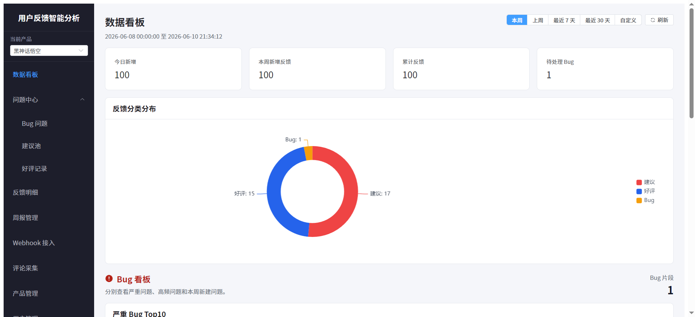

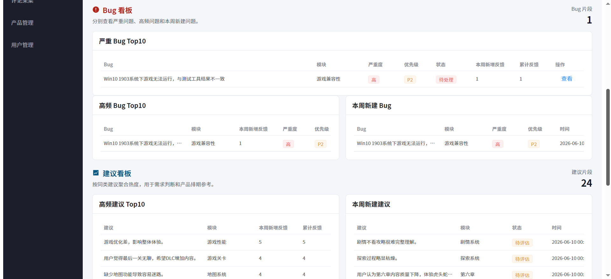

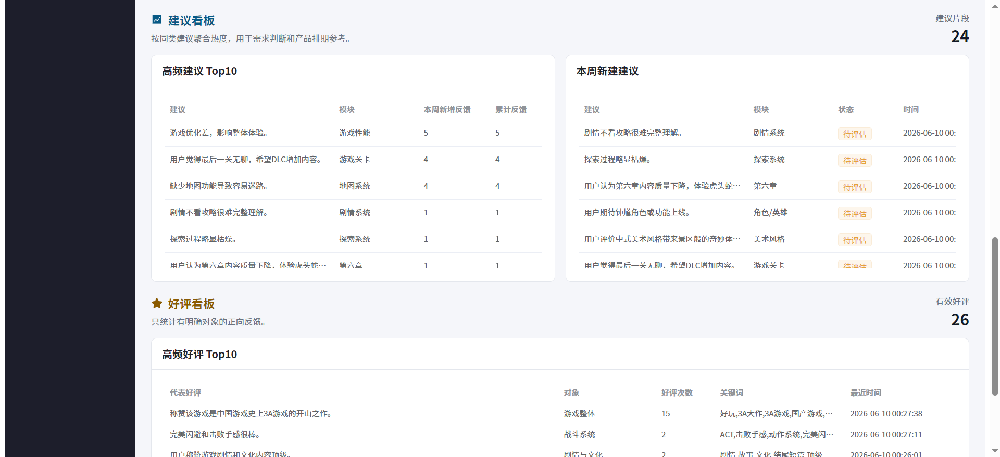

### 反馈列表

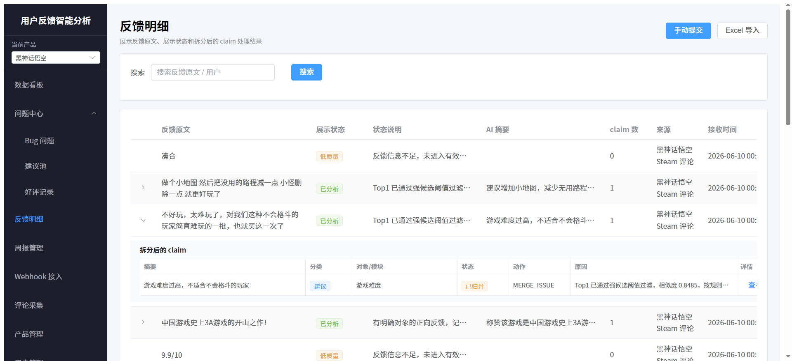

### 反馈详情

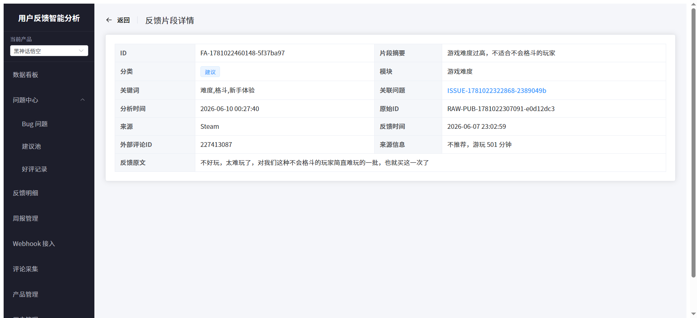

### Bug 列表

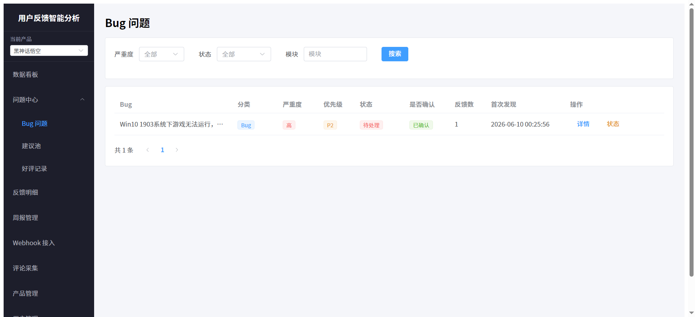

### Bug 详情

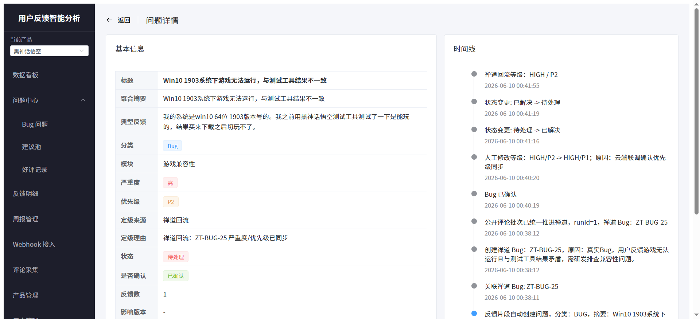

### 建议聚合

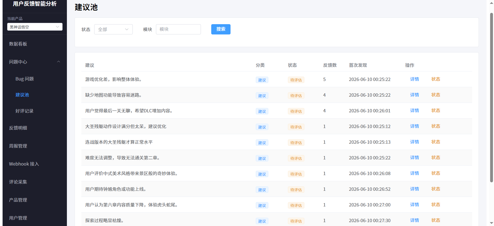

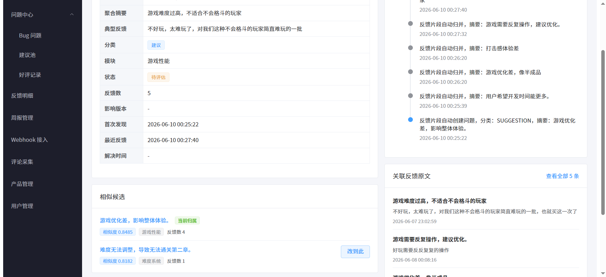

### 好评记录

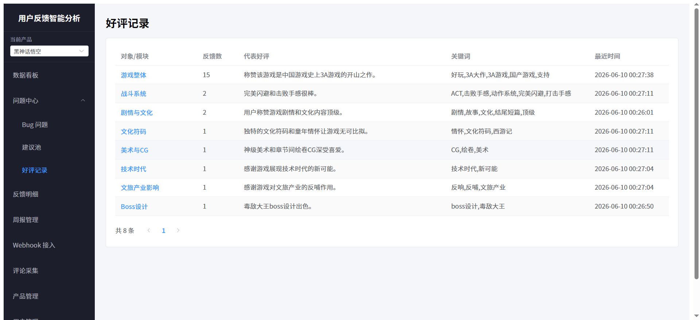

### 周报管理

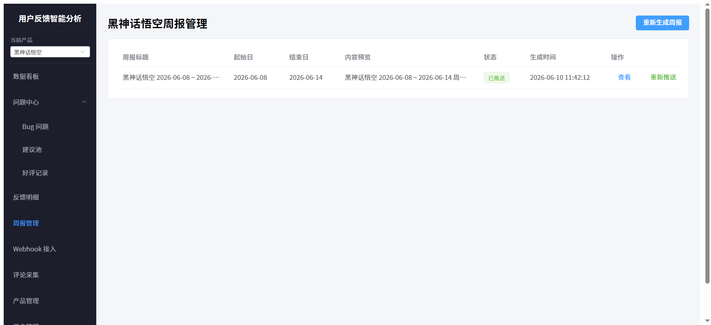

### Steam 评论采集

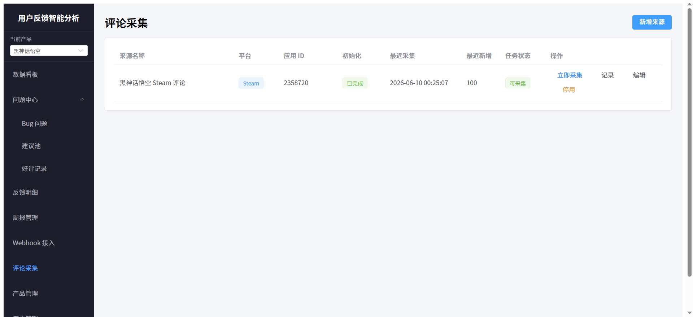

### 产品管理

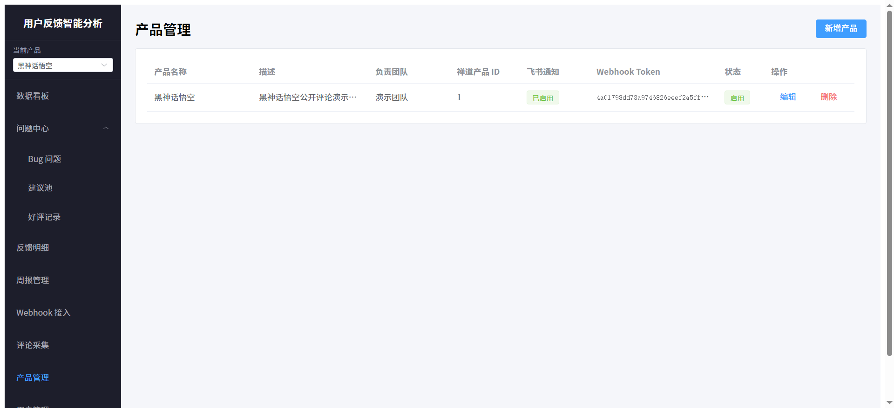

### Webhook 接入

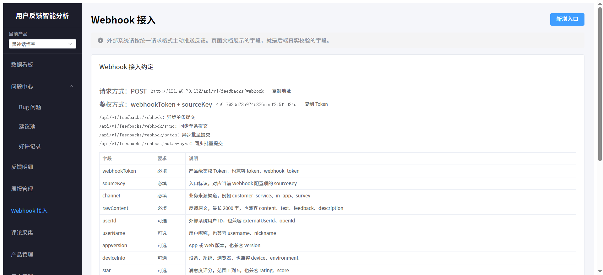

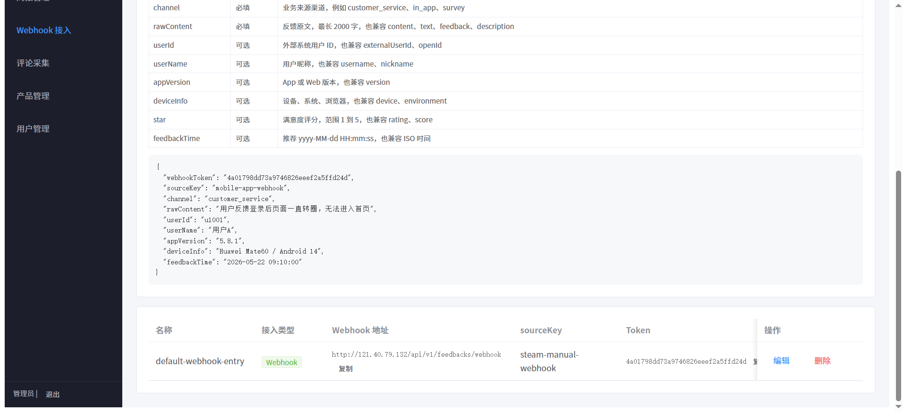

### 禅道 Bug 页

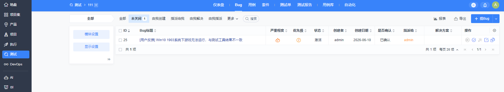

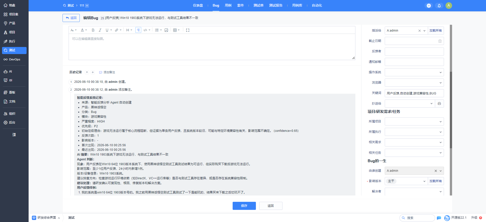

### 飞书周报消息

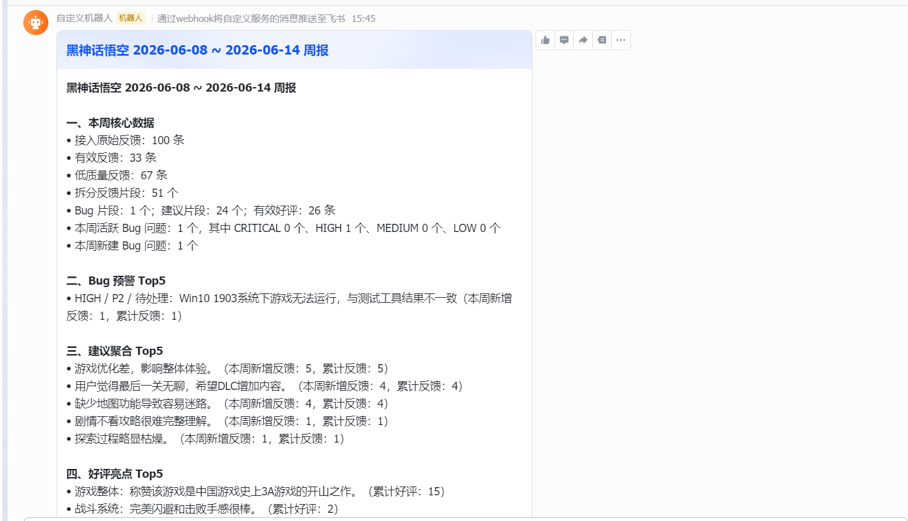

---

## 技术选型

| 分类 | 技术 |
|------|------|
| 后端框架 | Spring Boot、Spring MVC、Spring Data JPA |
| AI 能力 | Spring AI、DeepSeek、DashScope `text-embedding-v4` |
| 数据存储 | MySQL、Elasticsearch |
| 缓存与分布式组件 | Redis、Redisson |
| 消息队列 | Kafka |
| 前端框架 | Vue 3、Vite、Element Plus、Pinia |
| 第三方集成 | 禅道 API、禅道 Webhook、飞书机器人 |
| 测试与压测 | JUnit、Postman、JMeter |

---

## 项目结构

```text
├── backend
│   ├── src/main/java/com/feedback/analyzer
│   │   ├── controller      # REST 接口
│   │   ├── consumer        # Kafka 消费入口
│   │   ├── entity          # JPA 实体
│   │   ├── handler         # 定时任务
│   │   ├── repository      # 数据访问层
│   │   ├── service         # 业务服务与集成能力
│   │   └── config          # 安全、限流、初始化配置
│   └── src/main/resources
│       ├── prompts         # LLM Prompt 模板
│       └── es              # Elasticsearch 索引配置
├── frontend
│   └── src
│       ├── api             # 前端接口封装
│       ├── router          # 页面路由
│       ├── store           # 全局状态
│       └── views           # Dashboard / Feedback / Issue / Report 页面
├── docs
│   ├── .env.example        # 本地环境变量示例
│   └── screenshots         # README 展示截图
└── docker-compose.yml      # 本地依赖服务编排
```

---

## 快速开始

### 环境要求

| 工具 | 最低版本 |
|------|----------|
| JDK | 17+ |
| Maven | 3.9+ |
| Node.js | 18+ |
| pnpm | 8+ |
| Docker | 20+ |

### 本地运行

```bash
git clone https://github.com/Li-rainbow1/feedback-ai.git
cd feedback-ai
cp docs/.env.example docs/.env
```

按需修改 `docs/.env` 中的 MySQL、Redis、Kafka、Elasticsearch、模型 API、禅道和飞书配置。

启动基础设施：

```bash
docker compose up -d mysql redis elasticsearch zookeeper kafka
```

启动后端：

```bash
cd backend
mvn spring-boot:run
```

启动前端：

```bash
cd frontend
pnpm install
pnpm dev
```

常用验证：

```bash
cd backend
mvn test

cd ../frontend
pnpm build
```

默认访问地址：

- 后端：`http://localhost:8088`
- 前端：`http://localhost:5173`
